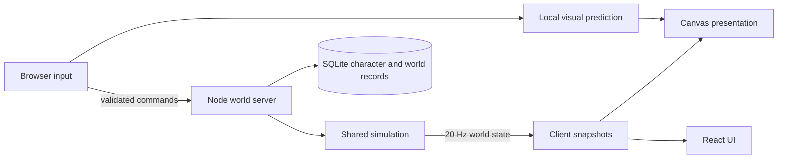

# System architecture

Status: implemented baseline. Emberfall is an online-only browser game. One Node process owns worlds and simulation; React presents application UI and Canvas 2D renders the moving world. There is no offline mode, desktop wrapper, room sharding or alternate renderer.

## Packages and ownership

| Package           | Responsibility                                                                               | Main entry points                                                                                        |
| ----------------- | -------------------------------------------------------------------------------------------- | -------------------------------------------------------------------------------------------------------- |
| `packages/common` | Shared types, Zod messages, geometry and simulation functions; exported as TypeScript source | [index.ts](../../packages/common/src/index.ts), [simulation.ts](../../packages/common/src/simulation.ts) |
| `packages/server` | HTTP(S), WebSocket sessions, world directory, authoritative ticks and SQLite saves           | [index.ts](../../packages/server/src/index.ts), [worlds.ts](../../packages/server/src/worlds.ts)         |
| `packages/client` | Connection/recovery, preferences, input, prediction, Canvas rendering and screen composition | [main.tsx](../../packages/client/src/main.tsx), [Arena.tsx](../../packages/client/src/Arena.tsx)         |
| `packages/ui`     | Controlled React/MUI presentation, theme, accessibility and Storybook                        | [public exports](../../packages/ui/src/index.ts), [component guide](../../packages/ui/README.md)         |

Node 24 executes server TypeScript during development. Vite builds the client and bundles the server with an SSR target. The Node HTTP/WebSocket application, not Vite, runs the multiplayer server. Turborepo coordinates workspace commands.

## Data flow

Local prediction improves perceived response; it never owns damage, health, death, loot or saved progress. High-frequency drawing uses animation frames and mutable presentation data rather than React updates per actor.

## Design map

- [Network and persistence](network-and-persistence.md): WORLD, CHAT and CHAR requirements; commands, session recovery, save format, validation and failure behavior.
- [Simulation](simulation.md): SCENE and COMBAT requirements; phase transitions, enemy scaling, shared hit paths, pause/resume and rewards.
- [Movement](movement.md): input acknowledgement, interpolation, wrapped geometry and predicted casts.
- [Presentation](presentation.md): UI and GRAPHICS requirements; settings, caches, audio, diagnostics and shared UI boundaries.
- [Operations](../operations.md): HTTPS, hosting, cache headers, backup and deployment.

## Change boundaries

Update a shared message schema, its server validation and client handling together when changing the wire contract. Persist only validated character progress and authorized world membership. Renderer-only changes must not alter gameplay geometry. Combat changes must cover both forest and training use of the shared simulation.

The current limits are eight players per world and bounded combat collections with full snapshots. There is no measured large-horde scalability guarantee. Profile a concrete target before adopting batching, delta snapshots, sharding or another renderer.

The accepted [uninterrupted progression constraint](../specs/progression.md) introduces no new message or database field yet. A future feature must define its data, transitions and migration only after its behavior is selected.
