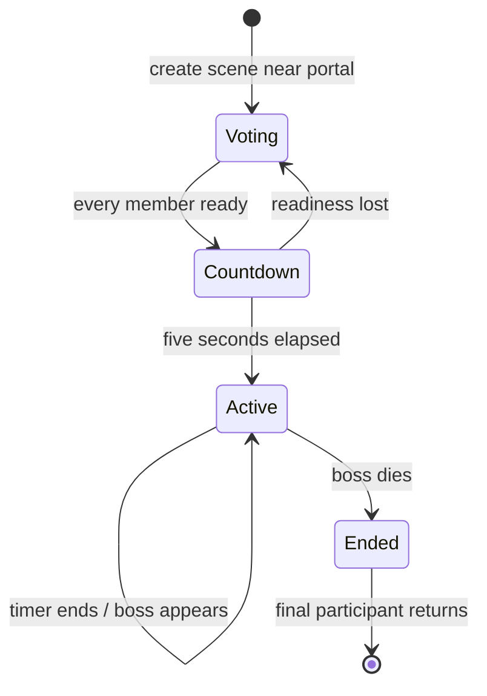

# Authoritative simulation

Status: implemented. Implements [village/scenes](../specs/scenes-and-village.md), [combat](../specs/combat.md), and the combat side of [controls](../specs/interface-and-audio.md#ui-02--combat-controls).

## Ownership and tick order

[worlds.ts](../../packages/server/src/worlds.ts) consumes validated player input on the 50 ms tick. [scenes.ts](../../packages/server/src/scenes.ts) ticks shared village training, reconciles readiness and advances forest state. [simulation.ts](../../packages/common/src/simulation.ts) owns combat, pause/resume, scaling and companions. [class-combat.ts](../../packages/common/src/class-combat.ts) owns ranged shots, ailments, the shared hit/reward path and DPS history. [enemies.ts](../../packages/common/src/enemies.ts) owns archetype stats and deterministic steering.

These functions are in `common` so prediction can reuse geometry. Only the server executes authoritative enemy AI, damage and reward decisions. Client visuals must not run a second combat simulation.

## Scene states

Electorate changes invalidate the countdown and readiness is reconciled against current membership. Only Forest/Easy is accepted. Late entry uses the existing active scene and deadline. Return portals close further entry; regeneration is a separate action allowed only when no living participants remain and the scene is not voting/countdown.

`pausedAt` suspends active scene progression when no living forest player remains. Resuming shifts relevant deadlines by the pause duration: boss timer, spawns, attack windows, projectiles, drops, debuffs and companion timing. A living village player does not keep the forest running. A disconnected participant remains part of the retained session during recovery; do not equate a missing socket with scene departure.

## Geometry and attacks

Village and forest share 4800×2560 wrapped geometry. Player movement passes through scenery. Enemies and Bear retain tree avoidance; enemy bodies use a wrapped spatial grid for separation. Distances, target choice, hit overlap and camera projections must use the same wrapped geometry.

Warrior/Bear melee uses a smoothed forward half-disc and per-swing hit tracking. Projectile movement and class effects share `fireClassAttack`, `advancePlayerShot`, `tickPlayerShots` and `hitEnemy`. Root projectiles retain their hit IDs for one bounce, select the nearest other living enemy with wrapped distance after the first impact, and track that target until impact or its death. Both impacts use the shared full-power hit path. Roots refresh one five-second stack and multiply ordinary enemy movement speed by 0.9; bosses receive no roots. Manual casts validate cooldown, life, area epoch, class and training range; increasing request IDs identify processed/rejected casts and the accepted attack. Presentation prediction is described in [movement](movement.md).

The new runtime shares `modelHitbox` in `common-new/hitboxes.ts` between authoritative combat and debug rendering. A model of size S has radius S/2 and center at (x, y + 15 - 7S/16), matching the sprite rectangle's center. Player and Bear models use S=48; enemies use their archetype size. Projectile overlap adds the projectile radius, and melee tests the model circle against the attack area. Feet remain movement coordinates and are omitted from the debug overlay.

Player base attacks and Bear share a 1000 ms cooldown in both runtimes; the new
runtime derives equipped attack timing from gear stats. UI shows the resulting
cooldown without also showing attacks per second.

Balance numbers are maintained once in the [combat specification](../specs/combat.md), with executable constants in the common package. Do not fork separate class rules for training, forest or the client.

## Scaling, rewards and temporary state

Count all forest members for party scaling, including dead members, but exclude village members and companions. When membership changes, adjust existing and pending enemies while preserving health percentage. Freeze an XP drop's amount at death; pickup distributes it to living forest players. Kill credit is a separate reward through the shared hit path. Training exits before granting kill rewards or creating drops.

Scene entities, projectiles, drops, damage events, companion state and DPS history are temporary. Scene completion clears hostiles while leaving collectible rewards and fixed return portals. Returning to the village restores HP/MP and existing Bear health and clears pending resurrection.

## Verification

Drive explicit timestamps rather than sleeping through two-minute runs. Use [scenes.test.ts](../../packages/server/src/scenes.test.ts), [classes.test.ts](../../packages/server/src/classes.test.ts), [enemies.test.ts](../../packages/server/src/enemies.test.ts), [training.test.ts](../../packages/server/src/training.test.ts) and [pass-through.test.ts](../../packages/server/src/pass-through.test.ts).

For changed combat, test the same effect in forest and training, wrapped overlap, duplicate hits/casts, dead targets, membership scaling, fractional rewards and companion ownership. Browser [scenes](../../tests/scenes.spec.ts), [enemies](../../tests/enemies.spec.ts) and [combat features](../../tests/combat-features.spec.ts) verify visible warnings and lifecycle behavior.
